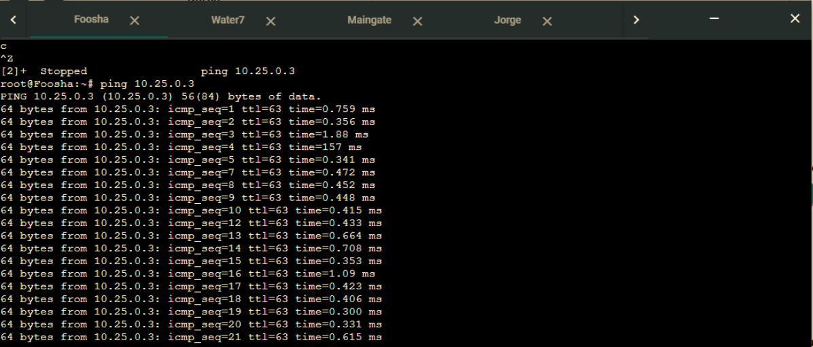
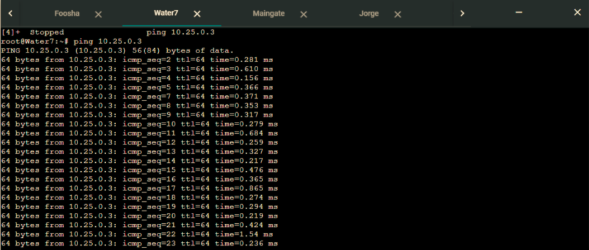
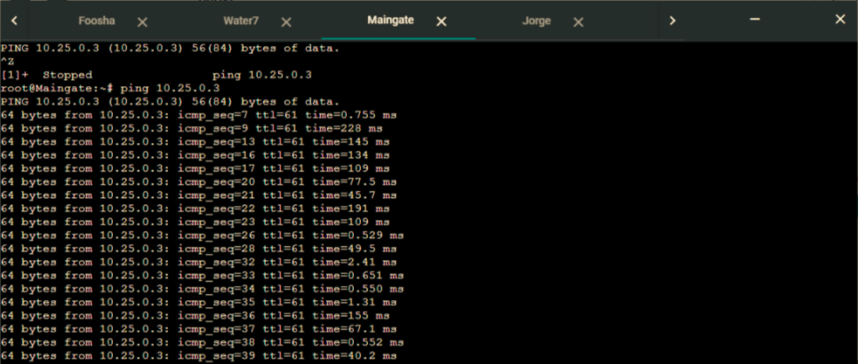
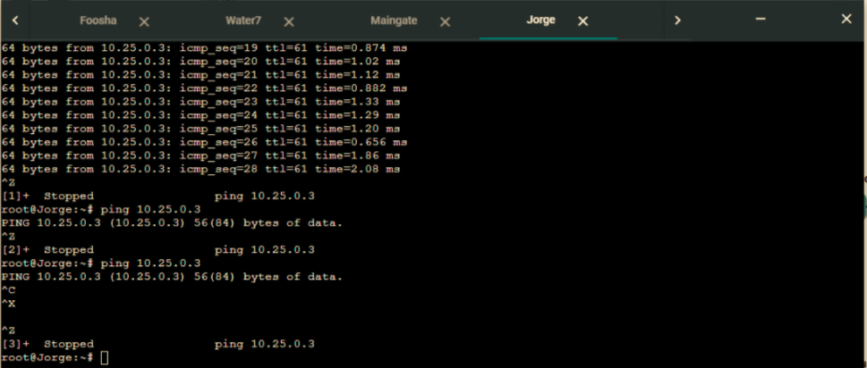
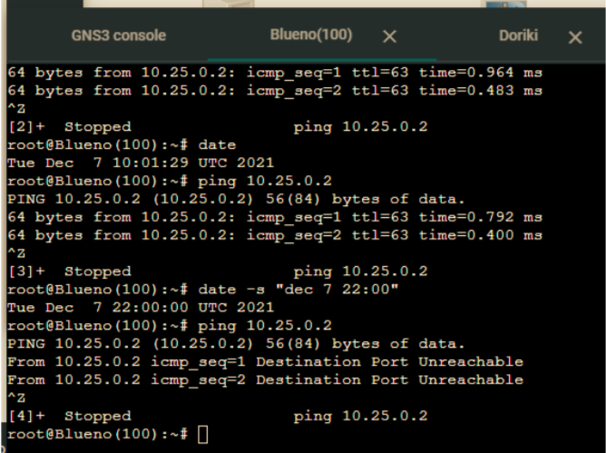
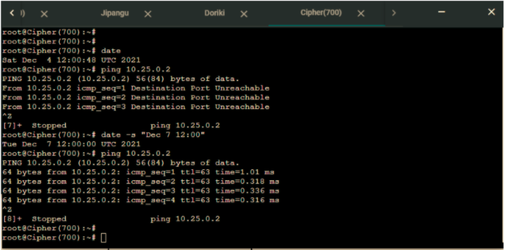

# Jarkom-Modul-5-D08-2021
- 05111940000233 Aristya Vika Wijaya
- 05111940000199 Aprilia Annisa Suryo
- 05111940000188 Riki Wahyu Nur Dianto

## SubNomor A-D
### A-B. Membuat topologi dengan menggunakan teknik VLSM 

 
 Berikut Merupakan Jumlah IP dan Netmask yang Didapat
 | Subnet | Jumlah IP | Netmask |
 | :---: | :-: | :-: |
 | A1 | 3 | /29 |
 | A2 | 101 | /25 |
 | A3 | 701 | /22 |
 | A4 | 2 | /30 |
 | A5 | 2 | /30 |
 | A6 | 301 | /23 |
 | A7 | 201 | /24 |
 | A8 | 3 | /29 |
 | TOTAL | 1314 | /21 |
 
 Perhitungan Alamat IP berdasarkan NID dan juga Netmask Menggunakan TREE Sebagai Berikut:
 

 Dari tree tersebut didapatkan pembagian IP sebagia berikut:
 

  Setting interface pada GNS3 Foosha
  **water** 7
``` bash 
  auto eth0
  iface eth0 inet static
  address 10.25.0.18
  netmask 255.255.255.252
         	gateway 10.25.0.17
 
  auto eth1
  iface eth1 inet static
  address 10.25.0.129
  netmask 255.255.255.128
 
  auto eth2
  iface eth2 inet static
  address 10.25.4.1
  netmask 255.255.252.0
 
  auto eth3
  iface eth3 inet static
  address 10.25.0.1
  netmask 255.255.255.248
  ```
 
**DORIKI**
``` bash
  auto eth0
  iface eth0 inet static
  address 10.25.0.2
  netmask 255.255.255.248
  gateway 10.25.0.1
```
**JIPANGU**
``` bash 
  auto eth0
  iface eth0 inet static
  address 10.25.0.3
  netmask 255.255.255.248
  gateway 10.25.0.1
```

**FOOSHA**
``` bash
  auto eth0
  iface eth0 inet dhcp

  auto eth1
  iface eth1 inet static
  address 10.25.0.21
  netmask 255.255.255.252

  auto eth2
  iface eth2 inet static
  address 10.25.0.17
  netmask 255.255.255.252
```

**GUANHAO**
``` bash 
  auto eth0
  iface eth0 inet static
    address 10.25.0.22
    netmask 255.255.255.252
    gateway 10.25.0.21

  auto eth1
  iface eth1 inet static
  address 10.25.2.1
  netmask 255.255.254.0

  auto eth2
  iface eth2 inet static
  address 10.25.1.1
  netmask 255.255.255.0

  auto eth3
  iface eth3 inet static
  address 10.25.0.9
  netmask 255.255.255.248
```

**JORGE**
``` bash 
  auto eth0
  iface eth0 inet static
    address 10.25.0.10
    netmask 255.255.255.248
    gateway 10.25.0.9
```

**MAINGATE**
``` bash 
  auto eth0
  iface eth0 inet static
    address 10.25.0.11
    netmask 255.255.255.248
    gateway 10.25.0.9
```
**Blueno**
``` bash
  auto eth0
  iface eth0 inet dhcp
```
**Chiper**
``` bash
auto eth0
  iface eth0 inet dhcp
```
**ELENA**
``` bash
auto eth0
  iface eth0 inet dhcp
```
**fukurou**
 ``` bash 
 auto eth0
  iface eth0 inet dhcp
```


### C. Melakukan routing pada Foosha sebagai berikut
``` bash
route add -net 10.25.1.0 netmask 255.255.255.0 gw 10.25.0.6                                     
route add -net 10.25.2.0 netmask 255.255.254.0 gw 10.25.0.22                                  
route add -net 10.25.0.8 netmask 255.255.255.248 gw 10.25.0.22                                    
route add -net 10.25.4.0 netmask 255.255.252.0 gw 10.25.0.18                                         
route add -net 10.25.0.128 netmask 255.255.255.128 gw 10.25.0.18                                 
route add -net 10.25.0.0 netmask 255.255.255.248 gw 10.25.0.18
```

### D. setting DHCP Relay
Pada water7, foosha, dan guanhao menginstall apt-get update, apt-get install isc-dhcp-relay -y
Lalu edit pada file `/etc/default/isc-dhcp-relay` pada bagian server dan interfaces menjadi

**Foosha**
``` bash
SERVERS="10.25.0.3"
INTERFACES="eth1 eth2"
```

**Water 7**
``` bash
SERVERS="10.25.0.3"
INTERFACES="eth0 eth1 eth2 eth3"
```

**Guanhao**
``` bash SERVERS="10.25.0.3"
INTERFACES="eth0 eth1 eth2"
```
**JIPANGU**
sebagai DHCP server, install apt-get install isc-dhcp-server
lalu pada file `/etc/dhcp/dhcpd.conf` edit menjadi

``` bash
subnet 10.25.0.128 netmask 255.255.255.128 {
	range 10.25.0.130 10.25.0.255;
	option routers 10.25.0.129;
	option broadcast-address 10.25.0.255;
	option domain-name-servers 10.25.0.2;
	default-lease-time 360;
	max-lease-time 7200;
}
 
subnet 10.25.0.0 netmask 255.255.255.248 {
}
 
subnet 10.25.4.0 netmask 255.255.252.0 {
	range 10.25.4.2 10.25.7.255;
	option routers 10.25.4.1;
	option broadcast-address 10.25.7.255;
	option domain-name-servers 10.25.0.2;
	default-lease-time 360;
	max-lease-time 7200;
}
 
subnet 10.25.2.0 netmask 255.255.254.0 {
	range 10.25.2.2 10.25.3.255;
	option routers 10.25.2.1;
	option broadcast-address 10.25.3.255;
	option domain-name-servers 10.25.0.2;
	default-lease-time 360;
	max-lease-time 7200;
}
 
subnet 10.25.1.0 netmask 255.255.255.0 {
	range 10.25.1.2 10.25.1.255;
	option routers 10.25.1.1;
	option broadcast-address 10.25.1.255;
	option domain-name-servers 10.25.0.2;
	default-lease-time 360;
	max-lease-time 7200;
}

```

lalu pada file `/etc/default/isc-dhcp-server` isi bagian interfaces dengan `eth0`

## NOMOR 1 Mengkonfigurasi Foosha menggunakan iptables, tetapi Luffy tidak ingin menggunakan MASQUERADE.
**Di foosha**
di console lakukan command
`iptables -t nat -A POSTROUTING -s 10.25.0.0/21 -o eth0 -j SNAT --to-source 192.168.122.79`

(source ambil dari ip a di foosha)

Keterangan:
- `-t nat`: Menggunakan tabel NAT karena akan mengubah alamat asal dari paket
- `-A POSTROUTING`: Menggunakan chain POSTROUTING karena mengubah asal paket setelah routing
- `-s 10.25.0.0/21`: Mendifinisikan alamat asal dari paket yaitu semua alamat IP dari subnet 10.25.0.0/21
- `-o eth0`: Paket keluar dari eth0 Foosha
- `-j SNAT`: Menggunakan target SNAT untuk mengubah source atau alamat asal dari paket
- `--to-s (ip eth0)`: Mendefinisikan IP source, di mana digunakan eth0 Foosha dengan rentang IP


## NOMOR 2 Mendrop semua akses HTTP dari luar Topologi kalian pada server yang memiliki ip DHCP dan DNS Server demi menjaga keamanan.
**Di foosha**
iptables -A FORWARD -d 10.25.0.0/29 -i eth0 -p tcp --dport 80 -j DROP

Keterangan:
- `-A FORWARD`: Menggunakan chain FORWARD
- `-p tcp`: Mendefinisikan protokol yang digunakan, yaitu tcp
- `--dport 80`: Mendefinisikan port yang digunakan, yaitu 80 (HTTP)
- `-d 10.25.0.0/29`: Mendefinisikan alamat tujuan dari paket (DHCP dan DNS SERVER ) berada pada subnet 10.25.0.0/29
- `-i eth0`: Paket masuk dari eth0 Foosha
- `-j DROP`: Paket di-drop

**Testing Nomer 2**
1. Install netcat di server Jipangu dan Doriki: apt-get install netcat
2. Pada Jipangu atau Doriki ketikkan: `nc -l -p 80`
3. Pada foosha ketikkan: `nmap -p 80 10.25.0.2` atau `nmap -p 80 10.25.0.3`


## NOMOR 3 Luffy meminta untuk membatasi DHCP dan DNS Server hanya boleh menerima maksimal 3 koneksi ICMP secara bersamaan menggunakan iptables, selebihnya didrop.

***Doriki & Jipangu***

Lakukan dengan :

`iptables -A INPUT -m state --state ESTABLISHED,RELATED -j ACCEPT`

dan

`iptables -A INPUT -p icmp -m connlimit --connlimit-above 3 --connlimit-mask 0 -j DROP`

Keterangan:
`-A INPUT`: Menggunakan chain INPUT

`-p icmp`: Mendefinisikan protokol yang digunakan, yaitu ICMP (ping)

`-m connlimit`: Menggunakan rule connection limit

`--connlimit-above 3`: Limit yang ditangkap paket adalah di atas 3

`--connlimit-mask 0` : Hanya memperbolehkan 3 koneksi setiap subnet dalam satu waktu

`-j DROP`: Paket di-drop

**Kemudian lakukan testing :**
1. Masukkan ke empat node berbeda
2. ping ke arah *jipangu* dengan menggunakan `ping 10.25.0.3`

### Gambar :










## NOMOR 4 Akses dari subnet Blueno dan Cipher hanya diperbolehkan pada pukul 07.00 - 15.00 pada hari Senin sampai Kamis.Selain itu di reject 

***Doriki***

*dari Blueno*
Masukkan command seperti ini :

`iptables -A INPUT -s 10.25.0.128/25 -m time --timestart 07:00 --timestop 15:00 --weekdays Mon,Tue,Wed,Thu -j ACCEPT`

`iptables -A INPUT -s 10.25.0.128/25 -j REJECT`

Lalu testing dengan ping ke arah Dorki `ping 10.25.0.2`

### Gambar :



*dari Chipper*

Masukkan command seperti ini :

`iptables -A INPUT -s 10.25.4.0/22 -m time --timestart 07:00 --timestop 15:00 --weekdays ` Mon,Tue,Wed,Thu -j ACCEPT`

`iptables -A INPUT -s 10.25.4.0/22 -j REJECT`

Lalu testing dengan ping ke arah Dorki `ping 10.25.0.2`

### Gambar :




## NOMOR 5 Akses dari subnet Elena dan Fukuro hanya diperbolehkan pada pukul 15.01 hingga pukul 06.59 setiap harinya.Selain itu di reject

***Doriki***

*Batas Akses Doriki Dari Elena*

Masukkan command seperti di bawah ini:

`iptables -A INPUT -s 10.25.2.0/23 -m time --timestart 15:01 --timestop 06:59 -j ACCEPT`

`iptables -A INPUT -s 10.25.2.0/23 -j REJECT`

Lalu testing dengan ping ke arah Dorki `ping 10.25.0.2`

### Gambar :


*Batas Akses Doriki Dari Fukurou*

Masukkan command seperti di bawah ini:

`iptables -A INPUT -s 10.25.1.0/24 -m time --timestart 15:01 --timestop 06:59 -j ACCEPT`

`iptables -A INPUT -s 10.25.1.0/24 -j REJECT`

Lalu testing dengan ping ke arah Dorki `ping 10.25.0.2`

### Gambar :


Keterangan:
- `-A INPUT` : Menggunakan chain INPUT 
- `-m time` : Menggunakan rule time
- `-timestart 15:01` : Mendefinisikan waktu mulai yaitu 15:00
- `-timestop 06:59` : Mendefinisikan waktu berhenti yaitu 07.00
- `-j ACCEPT` : Paket di-accept
- `-j REJECT` : Paket ditolak

## NOMOR 6 Luffy ingin Guanhao disetting sehingga setiap request dari client yang mengakses DNS Server akan didistribusikan secara bergantian pada Jorge dan Maingate

***Distribusikan Jorge dan Maingate***

*Mengarahkan Elena  ke Maingate dan Jorge*

Dengan command seperti di bawah ini:

`iptables -A PREROUTING -t nat -p tcp -d 10.25.0.0/29 --dport 80 -m statistic --mode nth --every 2 --packet 0 -j DNAT --to-destination  10.25.0.10:80`

`iptables -A PREROUTING -t nat -p tcp -d 10.25.0.0/29 --dport 80 -j DNAT --to-destination 10.25.0.11:80`

`iptables -t nat -A POSTROUTING -p tcp -d 10.25.0.10 --dport 80 -j SNAT --to-source 10.25.0.0:80`

`iptables -t nat -A POSTROUTING -p tcp -d 10.25.0.11 --dport 80 -j SNAT --to-source 10.25.0.0:80`

Testing untuk nomor 6:

1. Pada Guanhao, Jorge, Maingate dan Elena `install apt-get install netcat`

2. Pada Jorge / Maingate ketikkan perintah:  `nc -l -p 80`

3. Pada client Elena ketikkan perintah: `nc 10.25.0.0 80`

4. Ketikkan sembarang pada client Elena, nanti akan muncul bergantian

### Gambar :


(Untuk Cek IPTables yang udah diassign)
`iptables --list`
`iptables -L -n -t nat`


## Kendala:
1. Untuk nomor 2 harus  melakukan beberapa kali dulu baru status menjadi filtered
2. Kendala pada jaringan internet sehingga restart node dan menjalankan ulang scriptnya
3. Untuk nomor 6 harus beberapa kali restart node elena, karena beberapa kali connection refused


